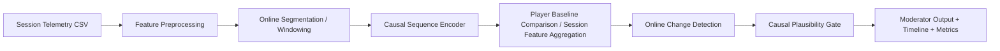

# Section 2: Overall Architecture, Workflow, and Main Functional Components

## Addendum: Two Data Modes

The current project has two aligned pipelines:

1. a **synthetic personalized anti-cheat demo**
2. a **real CSGO archive benchmark**

The real archive is stored under `/real_data/archive` as numpy tensors with shape `(players, 30, 192, 5)` using:

- `AttackerDeltaYaw`
- `AttackerDeltaPitch`
- `CrosshairToVictimYaw`
- `CrosshairToVictimPitch`
- `Firing`

The Streamlit app exposes these as separate tabs so the class demo can show both:

- a polished synthetic end-to-end anti-cheat story
- a harder real-data benchmark using held-out CSGO players

## System Overview

`NoScope-Bio` is a behavioral anti-cheat prototype built around **causal aim-telemetry modeling**.

The synthetic path is target-agnostic and uses only:

- view angles such as yaw and pitch
- angular motion and derived aim vectors
- fire-input timing
- timestamps
- server-side telemetry

The CSGO archive path uses the real archive's target-relative engagement fields in addition to angular motion because that information is explicitly present in the benchmark.

The goal is to learn each player's normal motor signature and then detect statistically abnormal shifts in that signature over time.

The system is organized as a six-stage pipeline:

1. session telemetry input
2. feature preprocessing and online segmentation
3. behavioral fingerprint encoding
4. baseline comparison or session-level classification
5. online change detection
6. causal-style validation and moderator-facing output



## Main Functional Components

### 1. Synthetic Session Generator

This component produces baseline and evaluation sessions for multiple synthetic players.

Each player has a stable individual style across:

- view-angle delta and angular velocity
- pause and burst timing
- correction style
- micro-jitter amplitude
- curvature tendencies
- fire cadence
- server-visible network conditions

The generator is designed to simulate more realistic human motor behavior using:

- smooth overlapping submovements
- signal-dependent noise
- session-level tempo variation
- pauses and hesitations
- corrective micro-motions

It also injects controlled session types:

- `clean`
- `aimbot`
- `triggerbot`
- `macro_consistency`
- `high_ping`
- `sensitivity_change`
- `patch_shift`

### 2. Feature Preprocessing And Online Segmentation

The raw view-angle stream is converted into a causal windowed sequence representation so the model compares recent behavioral intervals rather than full-session summaries.

Online segmentation is based on movement structure such as:

- velocity threshold crossings
- pauses
- jerk minima
- direction-change boundaries

### 3. Fingerprint Encoder

The main ML component is a causal temporal fingerprint model.

In the synthetic demo, it is trained on clean telemetry windows to predict player identity.

In the CSGO archive benchmark, it is trained on causal engagement windows to distinguish legit and cheater-like structure in real CSGO aim traces.

In the current prototype, this is implemented with a lightweight fingerprint network over flattened causal windows. The hidden representation of that model becomes the behavioral embedding used by the second-stage scorer and by the CSGO session-level feature table.

This is the main non-trivial ML contribution because it performs:

- sequence representation learning
- player-specific behavioral fingerprinting
- personalized anomaly detection support

### 4. Baseline Comparison Or Session-Level Classification

For the synthetic demo, the system stores per-player baseline embedding statistics and clean feature distributions.

For the CSGO archive benchmark, the system stores a legit-population baseline over held-out training players, because the archive does not provide clean historical baselines for the cheater cohort.

The final CSGO verdict shown in Streamlit comes from a saved **session-level logistic regression** model over aggregated causal window features such as:

- mean and max cheat probability
- encoder signal strength
- target-error-drop summaries
- lock-strength rises
- snap-power rises
- fire-alignment and fire-stability coupling
- entropy and curvature reductions

This logistic model was chosen as the deployed CSGO classifier because it had the best balanced-accuracy result in the offline model sweep.

### 5. Online Shift Detector

During evaluation, each new session is processed in causal time order. For each window, the system measures:

- embedding drift from baseline
- movement regularity shifts
- direction-entropy changes
- curvature and jerk changes
- fire-motion coupling changes

These scores are streamed into an online change detector to identify abrupt sustained transitions.

### 6. Causal-Style Validation Gate

Before labeling a session as suspicious, the system checks whether the observed shift is more plausibly explained by confounders such as:

- ping spikes
- jitter increases
- packet loss
- command-age inflation
- sensitivity changes
- environment or patch shifts

### 7. Review UI

The Streamlit UI supports:

- a synthetic demo tab and a CSGO archive tab
- selecting or uploading a synthetic session
- selecting a held-out CSGO engagement sample
- viewing a suspicion timeline
- viewing a yaw/pitch replay
- running a live timeline animation
- viewing server telemetry over time for synthetic sessions
- viewing engagement telemetry over time for CSGO sessions
- viewing explanation text for why the session was flagged or suppressed

## Input To The Algorithm / Model

### Input Format

The main input is a telemetry session CSV. Each row represents one causal time-step in the session.

### Input Examples

Representative view-angle and behavioral fields:

- `view_yaw`, `view_pitch`
- `yaw_delta`, `pitch_delta`
- `angular_speed`
- `angular_energy`
- `angular_acceleration`
- `angular_jerk`
- `aim_vector_x`, `aim_vector_y`, `aim_vector_z`
- `heading_change`
- `angular_velocity`
- `curvature`
- `motion_active`
- `burst_progress`
- `burst_duration_ms`
- `pause_ms`
- `view_straightness`
- `stability_score`
- `yaw_reversal`, `pitch_reversal`
- `fire_input`
- `time_since_fire_ms`
- `fire_motion_coupling`
- `last_fire_interval_ms`
- `last_stabilization_to_fire_ms`
- `flick_event`
- `flick_magnitude`
- `time_since_flick_ms`
- `direction_entropy_short`
- `micro_correction_score`
- `angular_speed_autocorr_short`

Representative server and environment fields:

- `ping_ms`
- `jitter_ms`
- `packet_loss_pct`
- `command_age_ms`
- `packet_interarrival_ms`
- `input_burstiness`
- `server_correction_magnitude`
- `tick_desync_ms`
- `sensitivity`

### Example Input Row

```text
session_id=P07_aimbot_02, player_id=P07, tick=418, t=20.90,
view_yaw=0.215, view_pitch=-0.041, yaw_delta=0.071, pitch_delta=-0.012,
angular_speed=0.188, angular_acceleration=0.041, angular_jerk=0.013,
heading_change=0.022, curvature=0.018, view_straightness=0.93,
direction_entropy_short=0.21, fire_input=1, time_since_fire_ms=142,
fire_motion_coupling=3.41, last_stabilization_to_fire_ms=54, flick_event=1,
ping_ms=31.7, jitter_ms=2.3, packet_loss_pct=0.08, command_age_ms=19.5
```

## Intermediate Processing Steps

### Step 1. Session Validation

The CSV is checked for required columns, session metadata, and causal input integrity.

### Step 2. Feature Scaling

Behavioral and network features are normalized using clean baseline sessions only, so suspicious sessions are evaluated relative to each player's historical normal behavior.

### Step 3. Online Segmentation And Windowing

The time series is split into overlapping trailing windows. Each window contains only current and past information, never future values.

### Step 4. Fingerprint Embedding

Each window is passed through the fingerprint encoder to produce an embedding vector representing the player's local behavioral identity.

### Step 5. Baseline Comparison Or Session Classification

The current embedding and summary features are compared against that player's stored baseline statistics.

For the CSGO benchmark, these window-level summaries are also aggregated into a session feature vector and passed into the saved logistic regression classifier that produces the official final session verdict in the app.

### Step 6. Online Change Detection

The system computes rolling suspicion scores and feeds them into an online change detector to find abrupt sustained behavioral shifts.

### Step 7. Causal Plausibility Gate

If the same time window also shows server-side instability such as elevated jitter, packet loss, or command age, the suspicion score is discounted unless the aim behavior still looks abnormally low-entropy or over-regular.

## Final Output Of The Algorithm / Model

### Data Output

For each analyzed session, the system produces:

- session verdict: `Suspicious` or `Likely Legit`
- session-level suspiciousness probability
- peak suspicion score from the causal window evidence stream
- change-point timestamp
- per-window suspicion timeline
- top shifted features vs baseline
- causal gate notes

### Measurement Output

The project exports split-aware evaluation metrics:

- accuracy
- balanced accuracy
- precision
- recall
- specificity
- false positive rate
- false negative rate
- majority-class baseline accuracy
- PPV / NPV at observed prevalence
- Bayes-theorem posterior cheat probabilities for lower assumed deployment prevalence

Evaluation is separated into:

- calibration-train sessions for fitting the cheat scorer
- validation sessions for threshold selection
- held-out test sessions for final reporting in the UI

Latest held-out test snapshot from the current synthetic evaluation:

- accuracy: `0.980`
- precision: `0.976`
- recall: `0.976`
- false positive rate: `0.018`
- false negative rate: `0.024`

Important note:

- these values are from the current synthetic evaluation environment and should be presented as demo results, not as proof of real-world deployment readiness

Current held-out test snapshot for the deployed CSGO session model:

- model: `baseline_logistic`
- accuracy: `0.7119`
- balanced accuracy: `0.7107`
- precision: `0.5792`
- recall: `0.7067`
- F1: `0.6366`
- MCC: `0.4073`

This is the official model used for the CSGO tab. The causal timeline remains in the interface as synchronized evidence, not as the final CSGO session classifier.

### Moderator-Facing Output

The UI is designed to show:

- when the behavioral drift began
- what changed in the aim telemetry
- whether network or environment confounders were present
- whether the final decision should be escalation or suppression

## Where The ML Enters Non-Trivially

The ML contribution is not a simple thresholding system.

1. A fingerprint model learns a compact behavioral embedding from raw aim-telemetry windows.
2. The system learns player-specific baseline distributions in embedding space.
3. A second learned layer maps anomaly evidence and confounders into a calibrated cheat probability.

For the real CSGO tab, the deployed final classifier is a saved session-level logistic regression model over aggregated causal window features, because that model outperformed the notebook LSTM sweep on balanced accuracy.

This means the project combines:

- sequence representation learning
- personalized anomaly detection
- probability calibration

while still keeping the online change detector and confounder gate interpretable.

## Deliverable Language You Can Use In Class

> Our model takes view angles, angular motion, fire timing, and server-side session signals as input, learns an individualized aim-telemetry fingerprint from clean sessions, monitors new sessions for abrupt identity drift using only causal windows, and uses a confounder-aware validation gate to distinguish suspicious automation-like behavior from plausible external causes such as lag or sensitivity changes.

Important limitation:

- some real FPS engines can also expose crosshair position in world space or raycast intersection points, but that is engine-specific and not modeled in this demo; the current prototype stays in normalized yaw/pitch space
